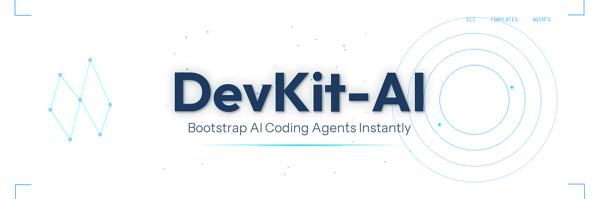

<div align="center">



[](https://www.python.org/downloads/)
[](LICENSE)
[](https://typer.tiangolo.com/)
[](https://rich.readthedocs.io/)
[](https://github.com/yulong-wu-jackson/DevKit-AI/stargazers)

**A lightweight CLI tool to bootstrap AI coding agent templates for your development projects.**

[Quick Start](#quick-start) • [Installation](#installation) • [Commands](#commands) • [Future Design](design)

---

</div>

## Overview

DevKit-AI provides pre-configured agents and commands for AI-powered development workflows. It installs battle-tested templates directly into your project, giving you instant access to:

- **code-explorer**: Deeply analyzes codebases by tracing execution paths
- **code-architect**: Designs feature architectures with implementation blueprints
- **code-reviewer**: Reviews code for bugs, quality issues, and convention adherence
- **feature-dev**: Orchestrates a complete 7-phase feature development workflow

## Installation

### For Users

#### Option 1: Persistent Installation (Recommended)

Install once and use everywhere:

```bash
uv tool install devkit-cli --from git+https://github.com/yulong-wu-jackson/DevKit-AI.git
```

Then use the tool directly:

```bash
devkit init my-project
devkit version
```

**Upgrade to latest version:**

```bash
uv tool install devkit-cli --force --from git+https://github.com/yulong-wu-jackson/DevKit-AI.git
```

**Uninstall:**

```bash
uv tool uninstall devkit-cli
```

#### Option 2: One-time Usage

Run directly without installing:

```bash
uvx --from git+https://github.com/yulong-wu-jackson/DevKit-AI.git devkit init my-project
```

**Benefits of persistent installation:**
- Tool stays installed and available in PATH
- No need to repeatedly download
- Better tool management with `uv tool list`, `uv tool upgrade`, `uv tool uninstall`
- Faster subsequent runs

### For Developers

If you want to contribute or modify DevKit-AI:

```bash
# Clone the repository
git clone https://github.com/yulong-wu-jackson/DevKit-AI.git
cd DevKit-AI

# Install dependencies and the package in editable mode
uv sync

# Run the CLI (uv automatically uses the venv)
uv run devkit version
uv run devkit init test-project

# Make changes and test immediately
# Changes to source code are reflected without reinstalling
```

## Quick Start

### Three Ways to Use DevKit

#### 1. Interactive Menu (Beginner-friendly)

```bash
# Run with no arguments to see the main menu
devkit
```

You'll see:
```
DevKit CLI

Main Menu:

  → Initialize Project
    Show Version
    Exit

Use ↑↓ arrows to navigate, Enter to select, Ctrl+C to exit
```

#### 2. Guided Setup (Prompts for missing info)

```bash
# Specify what you know, get prompted for the rest
devkit init my-project        # Prompts for agent selection
devkit init --claude          # Prompts for project path
devkit init                   # Prompts for both
```

#### 3. Direct Execution (Power users)

```bash
# Provide all info for zero-prompt execution
devkit init my-project --claude       # Create new project
devkit init --here --claude           # Install in current directory
devkit init . --claude                # Same as above
devkit init ~/projects/app --claude   # Absolute/relative paths supported
```

### Agent Selection

When prompted, select your preferred coding agent:

```
Select a coding agent:

  → Claude Code
    Cursor (not supported yet)

Use ↑↓ arrows to navigate, Enter to select, Ctrl+C to cancel
```

**Or skip prompts with flags:**
- `--claude`: Use Claude Code
- `--cursor`: Use Cursor (not supported yet)

### What gets installed

DevKit copies template files to your project:

```
your-project/
└── .claude/
    ├── agents/
    │   ├── code-explorer.md
    │   ├── code-architect.md
    │   └── code-reviewer.md
    ├── commands/
    │   └── feature-dev.md
    ├── hooks/
    │   ├── welcome-banner.sh
    └── settings.local.json    # Hooks configuration
```

## Usage

Once installed, you can use the agents and commands in your AI coding tool:

### Using with Claude Code

```bash
# Launch your Claude Code in your project directory with .claude/ folder
claude

# Use the feature-dev workflow
/feature-dev Implement user authentication

# Or invoke agents directly
# (depends on your AI coding tool's syntax)
```

### Hooks and Automation

DevKit includes Claude Code hooks that enhance your development experience:

**Welcome Banner Hook** - When you start a Claude Code session, you'll see:
- DevKit ASCII art banner
- Quick reference for available agents and commands
- Helpful reminders about workflows

The hook runs automatically on `SessionStart` and provides context to Claude about the available DevKit tools.

**How it works:**
- DevKit creates/updates `.claude/settings.local.json` with hooks configuration
- Safely merges with existing hooks if the file already exists
- Preserves any custom hooks you've added
- Only adds the DevKit welcome banner hook once

**Customizing Hooks:**
- Edit `.claude/hooks/welcome-banner.sh` to customize the welcome message
- Add more hooks to `.claude/settings.local.json` as needed

Learn more about Claude Code hooks: [Hooks Documentation](https://code.claude.com/docs/en/hooks)

### Conflict Handling

If you already have a `.claude/` folder, DevKit automatically:

1. Detects conflicting files
2. Creates a timestamped backup (`.claude.backup-YYYYMMDD-HHMMSS/`)
3. Installs the new templates
4. Shows you what changed

Example output:

```
✓ Successfully installed templates for Claude Code

• Found 2 existing file(s)
• Created backup: .claude.backup-20251107-120530
• Copied 4 file(s) to .claude/

Files installed:
  • .claude/agents/code-architect.md
  • .claude/agents/code-explorer.md
  • .claude/agents/code-reviewer.md
  • .claude/commands/feature-dev.md
```

## Commands

### `devkit` (Interactive Menu)

Run without arguments to access the interactive main menu:

```bash
devkit
```

Navigate with arrow keys and select:
- **Initialize Project**: Set up templates in a project
- **Show Version**: Display version information
- **Exit**: Quit the application

### `devkit init`

Initialize a project with AI coding agent templates.

```bash
devkit init [PROJECT_NAME] [OPTIONS]
```

**Arguments:**
- `PROJECT_NAME`: Project directory name/path (supports relative, absolute, or "." for current)

**Options:**
- `--here`: Initialize in current directory
- `--claude`: Use Claude Code agent (skip interactive selection)
- `--cursor`: Use Cursor agent (skip interactive selection)

**Usage Modes:**

**Direct Execution (no prompts):**
```bash
devkit init my-app --claude              # Create new project
devkit init --here --claude              # Install in current dir
devkit init ~/projects/myapp --claude    # Absolute path
devkit init ../sibling-project --claude  # Relative path
```

**Guided Setup (prompts for missing info):**
```bash
devkit init my-app      # Prompts: Which agent?
devkit init --claude    # Prompts: Which path?
devkit init             # Prompts: Which path? Which agent?
```

**Special Cases:**
```bash
devkit init .           # Same as --here (current directory)
```

### `devkit version`

Show version information.

```bash
devkit version
```

## Templates

### Agents

**code-explorer**
- Traces implementation from entry points to data storage
- Maps architecture layers and design patterns
- Documents dependencies and cross-cutting concerns
- Returns list of key files to read

**code-architect**
- Analyzes existing codebase patterns and conventions
- Designs complete feature architectures
- Provides implementation blueprints with specific files to modify
- Includes data flow diagrams and build sequences

**code-reviewer**
- Reviews code against project guidelines (CLAUDE.md)
- Detects bugs, security vulnerabilities, and quality issues
- Uses confidence-based filtering (only reports issues ≥80 confidence)
- Provides actionable fix suggestions

### Commands

**feature-dev**

A comprehensive 7-phase workflow for building features:

1. **Discovery**: Understand requirements
2. **Codebase Exploration**: Launch explorers to analyze existing code
3. **Clarifying Questions**: Resolve ambiguities before design
4. **Architecture Design**: Design multiple approaches, get user approval
5. **Implementation**: Build the feature
6. **Quality Review**: Launch reviewers to ensure quality
7. **Summary**: Document what was built

### Hooks

DevKit includes Claude Code hooks that automatically run at specific points in your coding session:

**SessionStart Hook - Welcome Banner**
- Displays DevKit ASCII art and helpful information when Claude Code starts
- Provides context about available agents and commands
- Can be customized to show project-specific information

**Configuration:**
- Hooks are configured in `.claude/settings.local.json` (created automatically)
- DevKit intelligently merges hooks with existing configuration
- The welcome banner script is in `.claude/hooks/welcome-banner.sh`

## Development

### Project Structure

```
DevKit-AI/
├── src/
│   └── devkit_cli/
│       ├── __init__.py      # Package version
│       ├── cli.py           # CLI commands (Typer)
│       ├── core.py          # Template manager
│       ├── ui.py            # Rich UI components
│       ├── config.py        # Agent configurations
│       ├── models.py        # Data models
│       ├── utils.py         # Utilities
│       └── templates/       # Bundled templates
│           └── claude-code/
│               ├── agents/
│               ├── commands/
│               └── hooks/
├── pyproject.toml           # Package configuration
├── CLAUDE.md                # Development conventions
└── README.md                # This file
```

### Updating Local Installation with Latest Code

When developing, you may need to update your local installation with the latest changes:

```bash
# Pull latest changes from repository
git pull origin main

# Sync dependencies (if pyproject.toml changed)
uv sync

# Test your changes immediately
uv run devkit version
uv run devkit init test-project
```

**Note**: Since the package is installed in editable mode (via `uv sync`), any changes you make to the source code in `src/devkit_cli/` are **automatically reflected** without needing to reinstall. Just save your changes and run the command again.

**When to run `uv sync`:**
- After pulling changes that modified `pyproject.toml`
- After adding/removing dependencies
- After switching branches

**You don't need to reinstall when:**
- Changing Python code in `src/devkit_cli/`
- Modifying template files
- Updating documentation

### Adding New Templates

1. Add template files to `src/devkit_cli/templates/your-agent/`
2. Update `AGENT_CONFIG` in `config.py`
3. Test with `uv run devkit init --here`

Example:
```python
# In config.py
AgentType.MY_AGENT: Agent(
    name=AgentType.MY_AGENT,
    display_name="My Agent",
    folder=".myagent",
    supported=True,
    description="My custom agent"
)
```

### Testing Your Changes

```bash
# Manual testing
uv run devkit init test-project
cd test-project
ls .claude/

# Clean up
cd .. && rm -rf test-project

# Test specific scenarios
uv run devkit init --here  # Test in current directory
uv run devkit version      # Test version command
```

## Architecture

DevKit follows a modular architecture with clear separation of concerns:

- **cli.py**: CLI commands, argument parsing
- **core.py**: Template installation logic (TemplateManager)
- **ui.py**: Rich console UI, interactive prompts
- **config.py**: Agent configurations
- **models.py**: Data classes (dataclasses)
- **utils.py**: Pure utility functions

See [CLAUDE.md](CLAUDE.md) for detailed development patterns and conventions.

## Supported Agents

### Currently Supported

- ✅ **Claude Code**: AI coding assistant by Anthropic

### Coming Soon

- ⏳ **Cursor**: AI-powered code editor (placeholder)

## Roadmap

### v1.0 (Current)
- ✅ Core CLI functionality
- ✅ Claude Code templates (3 agents + 1 command)
- ✅ Automatic conflict detection and backup
- ✅ Interactive agent selection

### v2.0 (Planned)
- [ ] Cursor support
- [ ] Template versioning and updates
- [ ] Custom template registry
- [ ] Additional agents (test-writer, refactoring, performance)
- [ ] Additional commands (quick-fix, refactor)
- [ ] Automated test suite

## Contributing

Contributions are welcome! Please see development patterns in [CLAUDE.md](CLAUDE.md).

## License

See [LICENSE](LICENSE) file for details.

## Acknowledgments

- Templates based on [feature-dev plugin](reference_repo/claude-code/plugins/feature-dev/)
- CLI patterns inspired by [spec-kit](reference_repo/spec-kit/)
- Built with [Typer](https://typer.tiangolo.com/) and [Rich](https://rich.readthedocs.io/)
